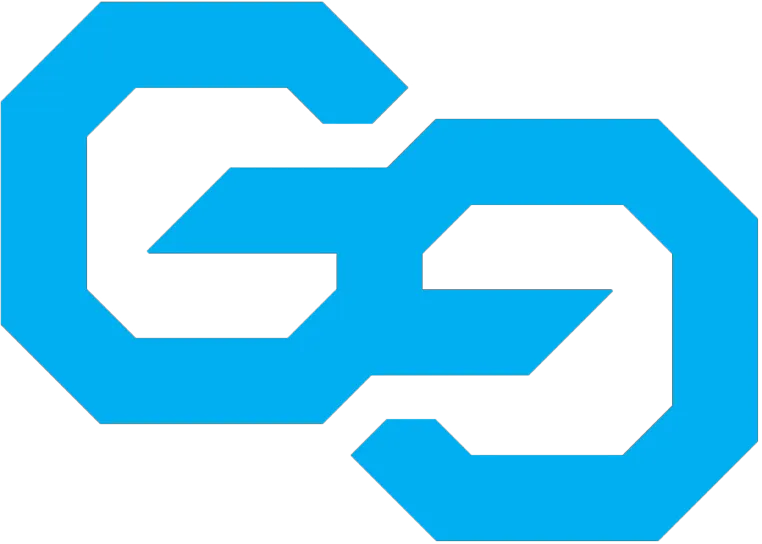

<p align="center">
  
</p>

<h1 align="center">🎮 GamersEdge POS</h1>

<p align="center">
  <strong>A Modern Point of Sale System for Gaming Stores</strong>
</p>

<p align="center">
  
  
  
  
  
</p>

---

## ✨ Features

| Feature | Description |
|---------|-------------|
| 🛒 **Point of Sale** | Fast, intuitive checkout with barcode scanning support |
| 📦 **Inventory Management** | Track products, stock levels, and low-stock alerts |
| 👥 **Customer Management** | Customer profiles, purchase history, and loyalty tracking |
| 🔧 **Repair Tracking** | Manage device repairs with status updates |
| 📊 **Dashboard Analytics** | Real-time sales metrics, charts, and insights |
| 📄 **Invoice Generation** | Professional invoices with print support |
| 👤 **User Management** | Role-based access control (Admin/Cashier) |
| 💾 **Backup & Restore** | Database backup with one-click restore |
| 🌙 **Dark Theme** | Premium dark UI with smooth animations |

---

## 🖥️ Screenshots

<p align="center">
  <em>Modern dark-themed interface with intuitive navigation</em>
</p>

---

## 🚀 Quick Start

### Prerequisites

- **Node.js** 18+ 
- **npm** 9+

### Installation

```bash
# Clone the repository
git clone https://github.com/yourusername/gamers-edge-pos.git
cd gamers-edge-pos

# Install dependencies
npm install
```

> **Note:** This project uses `better-sqlite3`. Native modules are automatically rebuilt for Electron during installation.

### Development

```bash
# Start development server with hot reload
npm run electron:dev
```

### Production Build

```bash
# Build for Windows
npm run electron:build
```

The executable will be created in the `release/` folder.

---

## 🛠️ Tech Stack

| Layer | Technology |
|-------|------------|
| **Frontend** | React 19, Vite 7, TailwindCSS 4, Framer Motion |
| **Desktop** | Electron 40 |
| **Database** | SQLite via better-sqlite3 |
| **Charts** | Recharts |
| **Icons** | Lucide React |
| **Routing** | React Router DOM 7 |

---

## 📁 Project Structure

```
gamers-edge-pos/
├── electron/          # Electron main process
│   ├── main.js        # Main entry point
│   ├── preload.js     # Preload scripts
│   └── db.js          # SQLite database layer
├── src/
│   ├── components/    # Reusable UI components
│   ├── pages/         # Application pages
│   ├── context/       # React context providers
│   └── utils/         # Utility functions
├── public/            # Static assets (logos, images)
└── package.json
```

---

## 📜 Available Scripts

| Command | Description |
|---------|-------------|
| `npm run dev` | Start Vite dev server only |
| `npm run electron:dev` | Start full Electron + Vite development |
| `npm run build` | Build frontend for production |
| `npm run electron:build` | Build complete Windows executable |
| `npm run lint` | Run ESLint |

---

## 🔐 Default Login

| Role | Username | Password |
|------|----------|----------|
| Admin | `admin` | `admin123` |

> ⚠️ **Important:** Change the default password after first login!

---

## 📝 License

This project is **proprietary software**. All rights reserved.

---

<p align="center">
  Made with ❤️ by <strong>Mathisha Angirasa</strong>
</p>
